<!-- 📺 VINTAGE TERMINAL PROFILE -->

  

<!-- 🐍 SNAKE CONTRIBUTION -->

  

 

<!-- 📈 GITHUB STATS -->

  
  

 

  <h3 style="color: #ffb000; font-family: monospace;">>> EQUIPPED ARSENAL <<</h3>
  

 

  <h3 style="color: #33ccff; font-family: monospace;">>> SOCIAL UPLINKS <<</h3>
  
  
  

 

<!-- 💬 BLUNT TECH QUOTE -->

   
  <table border="0" cellspacing="0" cellpadding="10">
    <tr>
      <td align="center" style="border: 2px dashed #33ff00; border-radius: 10px; background: rgba(0, 20, 0, 0.9);">
         <h3 style="color: #33ff00; font-family: monospace; margin: 0;"><i>"It works on my machine."</i> ¯\_(ツ)_/¯</h3>
         

         
<b>- The Developer's Motto</b>

      </td>
    </tr>
  </table>
   

